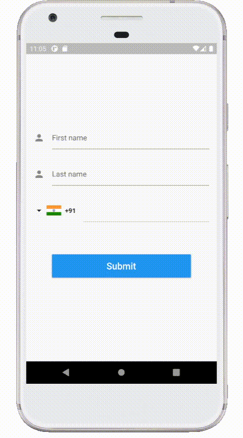
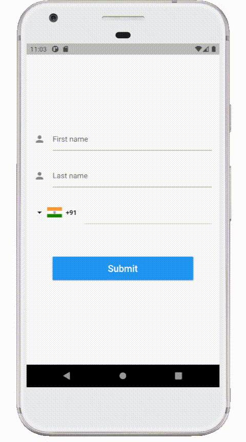

# Location API

Location API Demo Application - For Android using Flutter

## About

Flutter project demo for Android devices.

Location API demo application showcases sample login screen with international phone number + country code and validation. This application requires location permission to request users current location from android API and displays latitude, longtitude and location, sub location.

## Demo 

